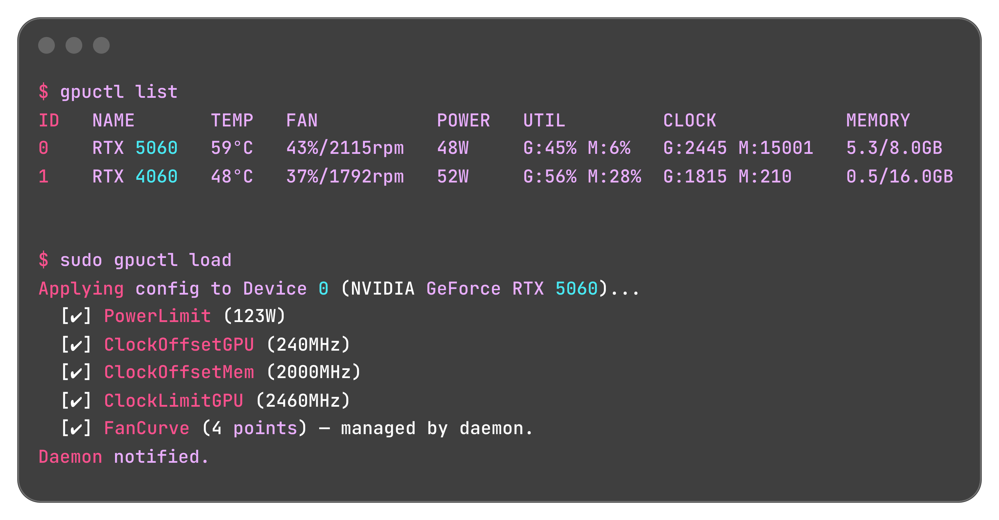

# gpuctl

[](https://opensource.org/licenses/MIT)
[](https://github.com/zhhc99/gpuctl)
[](https://github.com/zhhc99/gpuctl)
[](https://github.com/zhhc99/gpuctl/releases)



**GPU 状态管理和监控工具.**

## 🛠 功能

- [x] 查看功耗, 温度, 风扇, 频率, 内存状态
- [x] 调整功耗, 频率
- [ ] 调整风扇
- [x] 配置文件, 支持登录时自动应用

支持的 GPU:

- [x] NVIDIA (NVML)
- [ ] Intel (Level Zero)
- [ ] 不会有 AMD, 直到有跨平台的 API (to AMD: Intel 比你们起步晚, 但 API 仍然跨平台)

## 🚀 快速安装

**通过安装脚本:**

- Linux

  ```bash
  curl -sSL https://raw.githubusercontent.com/zhhc99/gpuctl/main/install.sh | bash
  ```

- Windows

  ```powershell
  powershell -ExecutionPolicy ByPass -Command "iwr -useb https://raw.githubusercontent.com/zhhc99/gpuctl/main/install.ps1 | iex"
  ```

**通过 go:**

```bash
# 💡 gpuctl service install 会自动向 /usr/local/bin/ 拷贝自身, 以避免服务权限问题.
go install github.com/zhhc99/gpuctl@latest
```

**卸载:**

- Linux

  ```
  curl -sSL https://raw.githubusercontent.com/zhhc99/gpuctl/main/uninstall.sh | bash
  ```

- Windows
  - 删除文件.
  - 执行 `taskschd.msc` (任务计划程序), 删除所有前缀为 "gpuctl@" 的任务 (如果有).

## 📖 基础用法

**查看所有 GPU 状态:**

```bash
gpuctl get

# on UNIX: watch -n 1 gpuctl get
```

**设置 100w 功耗墙, 只应用到编号为 0 的 NVIDIA GPU:**

```bash
gpuctl tune set pl=100 -d n:0
```

**核心超频 +210MHz, 降压使得核心频率不超过 2520MHz:**

```bash
gpuctl tune set cogpu=210 clgpu=2520
```

> ⚠️ 一般**不认为**超频损伤硬件, 但**激进**参数可能导致**花屏**或**冻结**.

**编辑配置文件:**

```bash
gpuctl config edit
```

更多用法见 `gpuctl --help`.

## 🔨 编译源代码

这是一个纯 go 项目, 编译非常简单.

```bash
go build -o gpuctl .
```

如果希望带有版本号:

```bash
go build -ldflags "-X 'gpuctl/cmd.Version=v1.0.0'"
```
