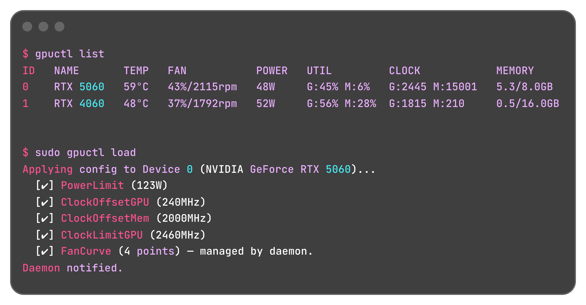

# gpuctl

[](https://opensource.org/licenses/MIT)
[](https://github.com/zhhc99/gpuctl)
[](https://github.com/zhhc99/gpuctl)
[](https://github.com/zhhc99/gpuctl/releases)



<!-- https://ray.so/#code=JCBncHVjdGwgbGlzdApJRCAgIE5BTUUgICAgICAgVEVNUCAgIEZBTiAgICAgICAgICAgUE9XRVIgICBVVElMICAgICAgICAgQ0xPQ0sgICAgICAgICAgICBNRU1PUlkKMCAgICBSVFggNTA2MCAgIDU5wrBDICAgNDMlLzIxMTVycG0gICA0OFcgICAgIEc6NDUlIE06NiUgICBHOjI0NDUgTToxNTAwMSAgIDUuMy84LjBHQgoxICAgIFJUWCA0MDYwICAgNDjCsEMgICAzNyUvMTc5MnJwbSAgIDUyVyAgICAgRzo1NiUgTToyOCUgIEc6MTgxNSBNOjIxMCAgICAgMC41LzE2LjBHQgoKCiQgc3VkbyBncHVjdGwgbG9hZApBcHBseWluZyBjb25maWcgdG8gRGV2aWNlIDAgKE5WSURJQSBHZUZvcmNlIFJUWCA1MDYwKS4uLgogIFvinJRdIFBvd2VyTGltaXQgKDEyM1cpCiAgW-KclF0gQ2xvY2tPZmZzZXRHUFUgKDI0ME1IeikKICBb4pyUXSBDbG9ja09mZnNldE1lbSAoMjAwME1IeikKICBb4pyUXSBDbG9ja0xpbWl0R1BVICgyNDYwTUh6KQogIFvinJRdIEZhbkN1cnZlICg0IHBvaW50cykg4oCUIG1hbmFnZWQgYnkgZGFlbW9uLgpEYWVtb24gbm90aWZpZWQuCg&language=shell&padding=16&background=false&darkMode=true&width=null&lineNumbers=false -->

**GPU 状态管理和监控工具.**

## 🛠 功能

- [x] 查看功耗, 温度, 风扇, 频率, 内存状态
- [x] 调整功耗, 频率
- [x] 调整风扇 (支持风扇曲线)
- [x] 配置文件, 支持登录时自动应用

支持的 GPU:

- [x] NVIDIA (NVML)
- [ ] Intel (Level Zero)
- [ ] 不会有 AMD, 直到有跨平台的 API (to AMD: Intel 比你们起步晚, 但 API 仍然跨平台)

## 📦 快速安装

执行脚本来安装和卸载.

### 安装

- **Linux:**

  ```bash
  curl -sSL https://raw.githubusercontent.com/zhhc99/gpuctl/main/install.sh | sudo bash
  ```

- **Windows**

  ```powershell
  powershell -ExecutionPolicy ByPass -Command "iwr -useb https://raw.githubusercontent.com/zhhc99/gpuctl/main/install.ps1 | iex"
  ```

### 卸载

- **Linux:**

  ```bash
  curl -sSL https://raw.githubusercontent.com/zhhc99/gpuctl/main/uninstall.sh | sudo bash
  ```

- **Windows**

  ```powershell
  powershell -ExecutionPolicy ByPass -Command "iwr -useb https://raw.githubusercontent.com/zhhc99/gpuctl/main/uninstall.ps1 | iex"
  ```

## 📖 常用命令

**检视**所有 GPU 状态:

```bash
$ gpuctl list
ID   NAME                      TEMP   FAN           POWER   UTIL         CLOCK            MEMORY
0    NVIDIA GeForce RTX 5060   59°C   42%/2100rpm   47W     G:49% M:6%   G:2445 M:15001   5.5/8.0GB
```

临时调整功耗墙为 130w 并**超频** +200MHz, 锁定频率不超过 2650MHz 以实现**降压**:

```
sudo gpuctl tune set pl=130 cogpu=200 clgpu=2650
```

> ⚠️ 一般**不认为**超频损伤硬件, 但**激进**参数可能导致**花屏**或**冻结**.

持久化配置文件, 每次开机都应用:

```bash
gpuctl conf edit
sudo gpuctl load
```

更多用法见 `gpuctl --help`.

## 🤔 常见问题

暂无.

## 🔨 编译源代码

在 `CGO_ENABLED=0` 下编译, 所得版本和 goreleaser 一致.

```bash
CGO_ENABLED=0 go build -o gpuctl .
```

如果希望带有版本号:

```bash
CGO_ENABLED=0 go build -ldflags "-X 'github.com/zhhc99/gpuctl/internal/cli.Version=v1.0.0'"
```

## 🚀 发布

提交代码后, 推送 tag 触发 goreleaser:

```bash
git tag vX.Y.Z
git push origin vX.Y.Z
```

GitHub Actions 会自动编译打包二进制然后发布. 可以手动填写该发布的 Release Notes.
